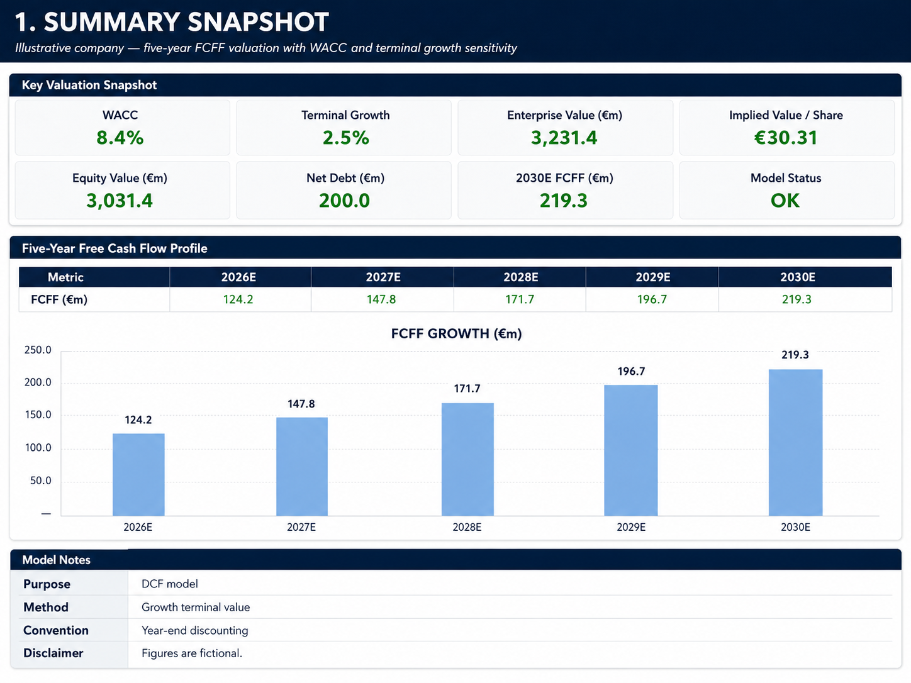
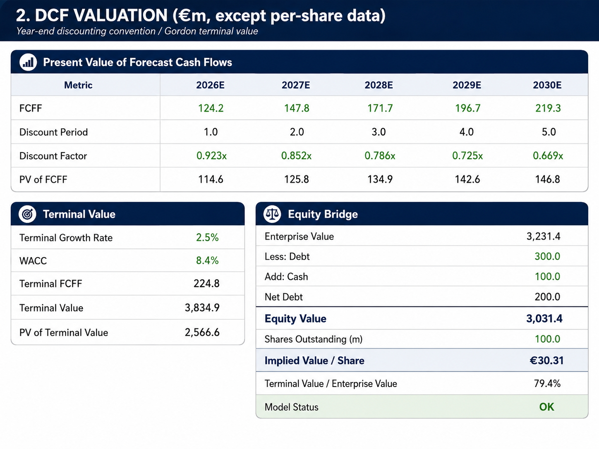
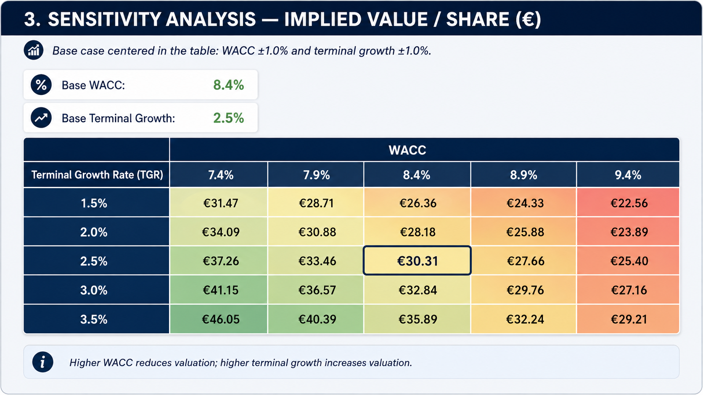

# DCF Valuation Financial Model

**Excel Financial Modeling | Corporate Finance | Valuation | FCFF | WACC | Sensitivity Analysis**

A complete Discounted Cash Flow valuation model developed in Microsoft Excel to estimate the intrinsic value of a fictional company.

## Project Overview

This project presents a complete **Discounted Cash Flow (DCF) valuation model** built in Microsoft Excel.

The objective is to estimate the intrinsic value of a fictional company based on its expected future **Free Cash Flow to Firm (FCFF)**.

The model includes historical financial analysis, a five-year financial forecast, WACC calculation, terminal value, enterprise value, equity value, implied value per share, and sensitivity analysis.

All financial data and assumptions used in this project are fictional and were created for educational and portfolio purposes.

## Model Preview

### 1. Summary Snapshot

The summary dashboard provides a quick overview of the main DCF valuation outputs, including Enterprise Value, Equity Value, WACC, Terminal Growth Rate and Implied Value per Share.

---

### 2. DCF Valuation

The valuation section presents the projected Free Cash Flow to Firm (FCFF), discount factors, present value of forecast cash flows, terminal value and the bridge from Enterprise Value to Equity Value.

---

### 3. Sensitivity Analysis

The sensitivity table illustrates how the implied value per share changes depending on different WACC and Terminal Growth Rate assumptions.

---

## Model Structure

The Excel model is organized into six main worksheets:

* **Summary** – Key valuation outputs and FCFF evolution
* **Historical** – Historical financial performance from 2023A to 2025A
* **Drivers** – Operating assumptions, WACC and capital structure
* **Forecast** – Financial projections from 2026E to 2030E
* **Valuation** – Discounted cash flow calculation and equity bridge
* **Sensitivity** – WACC and terminal growth sensitivity analysis
---

## Valuation Methodology

The model follows the following process:

**Historical Financials → Forecast → EBIT → NOPAT → FCFF → Discounted Cash Flows → Terminal Value → Enterprise Value → Equity Value → Implied Value per Share**

---

## Historical Financial Analysis

The historical section analyzes the company's operating performance from 2023 to 2025.

Key metrics include:

* Revenue / Chiffre d'affaires
* Revenue Growth
* COGS / Cost of Sales
* Gross Profit
* Gross Margin
* OPEX
* EBIT / Résultat opérationnel
* EBIT Margin
* Depreciation & Amortization
* CapEx
* Net Working Capital / BFR

The historical analysis provides the basis for the forecast assumptions used in the DCF model.

---

## Financial Forecast

The company is projected over a five-year period from **2026E to 2030E**.

The main operating assumptions include:

* Revenue growth
* COGS as a percentage of revenue
* OPEX as a percentage of revenue
* Depreciation & Amortization as a percentage of revenue
* Capital Expenditure as a percentage of revenue
* Net Working Capital as a percentage of revenue
* Corporate tax rate

The model assumes a gradual normalization of revenue growth and moderate operating leverage over the forecast period.

---

## Free Cash Flow to Firm

Free Cash Flow to Firm is calculated as:

**FCFF = NOPAT + D&A − CapEx − Change in NWC**

Where:

* **NOPAT** = EBIT × (1 − Tax Rate)
* **D&A** = Depreciation & Amortization
* **CapEx** = Capital Expenditure
* **Change in NWC** = Change in Net Working Capital / Variation du BFR

Projected FCFF:

| Year  | FCFF (€m) |
| ----- | --------: |
| 2026E |     124.2 |
| 2027E |     147.8 |
| 2028E |     171.7 |
| 2029E |     196.7 |
| 2030E |     219.3 |

---

## WACC Calculation

The **Weighted Average Cost of Capital (WACC / CMPC)** is used to discount future FCFF.

### Cost of Equity

The Cost of Equity is calculated using the Capital Asset Pricing Model:

**Cost of Equity = Risk-Free Rate + Beta × Equity Risk Premium**

Assumptions:

* Risk-Free Rate: **3.0%**
* Equity Risk Premium: **6.0%**
* Beta: **1.15**

Result:

**Cost of Equity = 9.90%**

### Cost of Debt

The after-tax Cost of Debt is calculated as:

**After-Tax Cost of Debt = Pre-Tax Cost of Debt × (1 − Tax Rate)**

With:

* Pre-Tax Cost of Debt: **5.0%**
* Tax Rate: **25.0%**

Result:

**After-Tax Cost of Debt = 3.75%**

### WACC

The model assumes:

* Equity Value used for capital structure: **€900m**
* Debt: **€300m**
* Equity Weight: **75%**
* Debt Weight: **25%**

Result:

**WACC = 8.36%**

---

## Terminal Value

The Terminal Value is calculated using the **Gordon Growth Method**:

**Terminal Value = FCFFₙ × (1 + g) / (WACC − g)**

The base case assumes:

* Terminal Growth Rate: **2.50%**
* WACC: **8.36%**

The Terminal Value is then discounted back to present value.

---

## Valuation Results

The base-case DCF produces the following results:

| Valuation Metric        |     Result |
| ----------------------- | ---------: |
| WACC                    |      8.36% |
| Terminal Growth Rate    |      2.50% |
| Enterprise Value        |  €3,231.4m |
| Debt                    |    €300.0m |
| Cash                    |    €100.0m |
| Net Debt                |    €200.0m |
| Equity Value            |  €3,031.4m |
| Shares Outstanding      |     100.0m |
| Implied Value per Share | **€30.31** |

Enterprise Value is calculated as:

**Enterprise Value = PV of Forecast FCFF + PV of Terminal Value**

Equity Value is calculated as:

**Equity Value = Enterprise Value − Debt + Cash**

Finally:

**Implied Value per Share = Equity Value / Shares Outstanding**

---

## Sensitivity Analysis

Because DCF valuation is highly dependent on long-term assumptions, the model includes a sensitivity analysis based on:

* WACC
* Terminal Growth Rate

The base-case valuation is approximately **€30.31 per share** at:

* **8.36% WACC**
* **2.50% Terminal Growth Rate**

The analysis illustrates that:

* A higher WACC decreases the valuation.
* A higher terminal growth rate increases the valuation.

This provides a range of potential intrinsic values instead of relying exclusively on a single valuation scenario.

---

## Key Financial Concepts Applied

This project demonstrates practical knowledge of:

* Discounted Cash Flow Valuation
* Financial Modeling
* Corporate Finance
* Financial Forecasting
* Free Cash Flow to Firm
* NOPAT
* Working Capital / BFR
* Capital Expenditure
* CAPM
* Cost of Equity
* Cost of Debt
* WACC / CMPC
* Terminal Value
* Gordon Growth Model
* Enterprise Value
* Equity Value
* Sensitivity Analysis
* Microsoft Excel

---

## Excel Modeling Conventions

The model follows common financial modeling conventions:

* **Blue font** = hardcoded assumptions
* **Green font** = links to other worksheets
* **Black font** = formulas
* **Yellow cells** = key editable assumptions

This structure makes the model easier to review, audit and modify.

---

## Files

`DCF_Valuation.xlsx`

Complete Excel DCF valuation model including historical analysis, operating assumptions, financial forecast, FCFF calculation, WACC, terminal value, equity bridge and sensitivity analysis.

---

## Disclaimer

This project was created exclusively for **educational and portfolio purposes**.

The company, historical financial information and valuation assumptions are fictional and should not be interpreted as investment advice or as the valuation of a real company.
